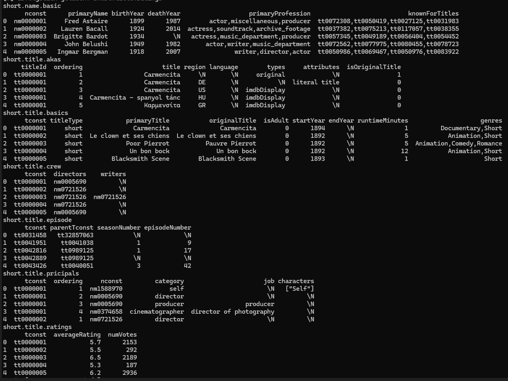
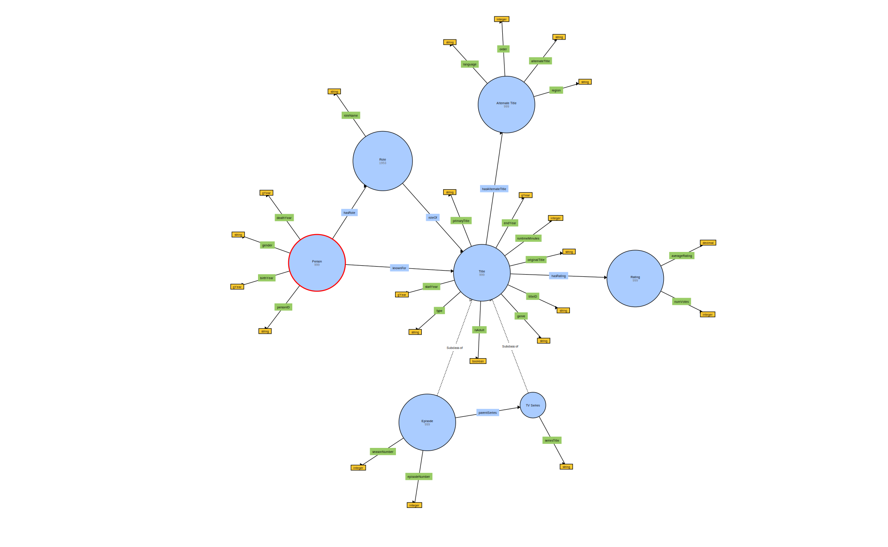

# Semantic Web

## Motivation

This Repository shows the progression and result in the course "Semantic Web", in which I transformed a database of my choice in semantic data. 
I chose the Internet Movie Database, commonly known as IMDb, downloaded their public data-tables (https://developer.imdb.com/non-commercial-datasets/) and created an ontology graph for the data in turtle. 
Then I wrote a python script that filled the ontology with the data from the tsv files and transformed it in machine readable RDF format. 

# Directories

## notebook and references

Here you can find a jupyter notebook explaining the whole process and the images that are referenced within the notebook.

## ontologies

contains the different stages of the ontology, which I finetuned in the process. The first versions came up in the seminars, the later versions I wrote while writing the URI definitions in the transformation script. 

## data

contains short versions of the raw data tables, which I cropped to 100 rows to process and do tests with them efiiciently. 

## scripts

contains different stages of the transformation scripts. Some of the script is inspired by Paulo Di Ricardos sample script, the latest version is also refined by AI. https://gitlab.dit.htwk-leipzig.de/paulo.carmo/f1worldchampionship

## img

contains images for samples and further explanations

# Sample images

## data visualized in table format

## final result (ontology graph with loaded test data) visualized with WebVOWL

Can also be loaded in better quality and more data by uploading the respective .ttl file to https://service.tib.eu/webvowl/

